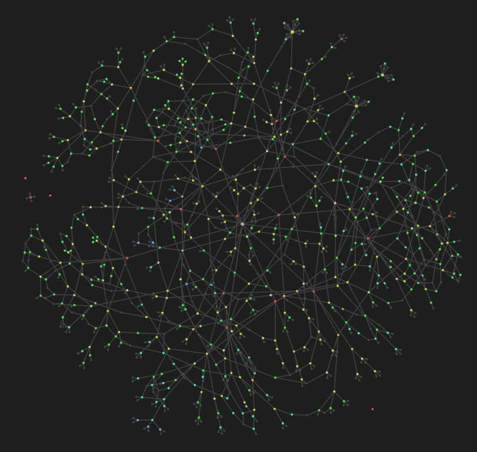

# DSA Practice - The Algorithm Pattern Taxonomy

> **A comprehensive, hierarchically-organized collection of Data Structures & Algorithms patterns for technical interview preparation and competitive programming mastery.**

## What's in This Repository?

- **19 Complete Pattern Taxonomies** - Every major algorithm pattern broken down into learnable sub-patterns
- **1000+ LeetCode Problems Mapped** - Problems organized by specific techniques, not just random difficulty
- **Hierarchical Learning Path** - From fundamentals to advanced techniques with clear progression
- **Pattern Interconnections** - Understand how algorithms relate and build upon each other
- **Interview-Focused** - Prioritized by real interview frequency and importance

---

## **Learning Roadmap**

### **Tier 1: Foundation Patterns** *(Start Here)*
Master these first - they're the building blocks for everything else:

| Pattern | Problems | Why Essential |
|---------|----------|---------------|
| [Two Pointers](Taxonomies/Tier%201/1.%20Two%20Pointers.md) | 100+ | Simple technique, immediate wins, builds pattern recognition |
| [Hash Table](Taxonomies/Tier%201/2.%20Hash%20Table.md) | 150+ | O(1) operations, foundation for optimization |
| [Stack & Queue](Taxonomies/Tier%201/3.%20Stack%20and%20Queue.md) | 100+ | LIFO/FIFO operations, parsing, BFS/DFS |
| [Linked List](Taxonomies/Tier%201/4.%20Linked%20List.md) | 75+ | Pointer manipulation, two-pointer applications |
| [Sorting Algorithms](Taxonomies/Tier%201/5.%20Sorting%20Algorithms.md) | 100+ | All sorting paradigms and applications |

### **Tier 2: Core Algorithms** *(After Tier 1)*
Advanced patterns that build on foundations:

| Pattern | Problems | Focus Area |
|---------|----------|------------|
| [Traversal Algorithms](Taxonomies/Tier%202/6.%20Traversal%20Algorithms%20Pattern.md) | 195+ | Essential for trees/graphs, recursive thinking |
| [Binary Search](Taxonomies/Tier%202/7.%20Binary%20Search.md) | 100+ | Logical thinking, extends beyond just searching |
| [Heap Priority Queue](Taxonomies/Tier%202/8.%20Heap%20Priority%20Queue.md) | 50+ | Top-K problems, scheduling, graph algorithms |
| [Prefix Sum](Taxonomies/Tier%202/9.%20Prefix%20Sum.md) | 100+ | Range queries, subarray problems |

### **Tier 3: Specialized Patterns**
| Pattern | Description |
|---------|-------------|
| [Greedy Algorithms](Taxonomies/Tier%203/10.%20Greedy%20Algorithms.md) | Optimization through local choices |
| [Backtracking](Taxonomies/Tier%203/11.%20Backtracking.md) | Combinatorial generation, constraint satisfaction |
| [Dynamic Programming](Taxonomies/Tier%203/12.%20Dynamic%20Programming.md) | Highest ROI pattern, most complex problems |
| [Divide & Conquer](Taxonomies/Tier%203/13.%20Divide%20and%20Conquer.md) | Recursive problem decomposition |

### **Tier 4: Advanced Techniques**
| Pattern | Description |
|---------|-------------|
| [Trie](Taxonomies/Tier%204/14.%20Trie.md) | String processing, prefix matching |
| [Union Find](Taxonomies/Tier%204/15.%20Union%20Find.md) | Graph connectivity, dynamic components |
| [Bit Manipulation](Taxonomies/Tier%204/16.%20Bit%20Manipulation.md) | Binary operations, XOR tricks, bitmask DP |
| [Segment Tree & Fenwick Tree](Taxonomies/Tier%204/17.%20Segment%20Tree%20and%20Fenwick%20Tree.md) | Advanced range queries |
| [Combinatorics & Number Theory](Taxonomies/Tier%204/18.%20Combinatorics%20and%20Number%20Theory.md) | Mathematical algorithms, game theory |
| [Design Patterns](Taxonomies/Tier%204/19.%20Design%20Pattern.md) | System design, custom data structures |

---

## **Visualize Cross-Pattern Relationships**

---

### **For Each Pattern:**
1. **Study the taxonomy** - Understand the hierarchical breakdown
2. **Start with basics** - Master fundamental sub-patterns first  
3. **Implement examples** - Use provided problem mappings
4. **Practice variations** - Work through the pattern tree
5. **Combine patterns** - Use cross-references to build complex solutions

---

## **Contributing**

We welcome contributions! Here's how you can help:

- **Report Issues**: Found a problem mapping or explanation issue?
- **Suggest Improvements**: Ideas for better organization or missing patterns?
- **Add Examples**: More code implementations for specific patterns?
- **Update Problem Links**: Help keep LeetCode problem references current

---

## **Additional Resources**

- [Algorithm Templates](Taxonomies/Algorithm_Templates.md) - Ready-to-use code templates
- [Algorithm Relationships](Taxonomies/Algorithm_Relationships.md) - Visual pattern connections

---

## **Repository Stats**

- **19 Complete Pattern Taxonomies** 
- **1000+ LeetCode Problems Mapped**
- **100,000+ Lines of Documentation**
- **4-Tier Difficulty Progression**
- **Cross-Pattern Relationship Mapping**

---

## ⭐ **Star This Repository**

If this helps your interview preparation or competitive programming journey, please ⭐ **star this repository** to help others discover it!

---

**[Start with Tier 1 Patterns](Taxonomies/Tier%201/) • [Browse All Patterns](Taxonomies/)**

---

**Built with ❤️ for the programming community**

Happy Coding!

